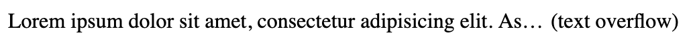

```html

<style>

  div.fixed-width {
    width: 500px;
    display: flex;
  }

  div.auto-width {
    overflow: hidden;
    white-space: nowrap;
    text-overflow: ellipsis;
    flex: 1;
  }

  div.static-width {
    width: auto;
  }

</style>

<div class="fixed-width">
  <div class="auto-width">
    Lorem ipsum dolor sit amet, 
    consectetur adipisicing elit.
    Assumenda id illum officiis omnis
    rerum sunt tempora veniam voluptatibus. 
    Harum magnam magni veritatis.
    Accusantium dolorem doloribus harum maxime,
    modi quasi veritatis.
  </div>
  <div class="static-width">(text overflow)</div>
</div>
```

#### 效果如下


